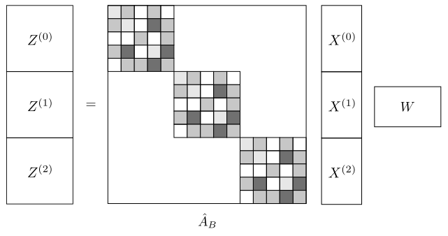
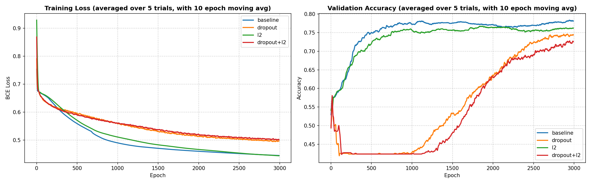

# Graph Convolutional Networks (GCNs) – Supervised Graph Classification

This project is an extension of the previous project on **Graph Convolutional Networks (GCNs)**, where supervised graph classification is performed instead of semi-supervised node classification.

Again, the architecture is based on the 2017 Kipf and Welling paper "*Semi-Supervised Classification with Graph Convolutional Networks*":

The model is applied to the **PROTEINS** dataset, which contains 1,113 proteins as graphs where every node is an amino acid, and there is an edge between every pair of amino acids that is less than 6 Angstroms apart. 

## Background / Context
Kipf and Welling proposed to the following widely used propagation rule as explained in the other repository in more detail:

$$
H^{(l+1)} = \sigma\left( \tilde{D}^{-1/2} \tilde{A} \tilde{D}^{-1/2} H^{(l)} W^{(l)} \right)
= \sigma\left( \hat{A} H^{(l)} W^{(l)} \right)
$$

where $\tilde{A} = A + I$ adds self-loops, $\tilde{D}$ is the corresponding degree matrix, and $\hat{A}$ is the normalized adjacency matrix.

This normalization is crucial: it prevents feature magnitudes from growing uncontrollably and ensures that nodes with many neighbors do not dominate the aggregation process. The addition of self-loops allows each node to retain and propagate its own features alongside information from its neighbors.

The key for efficient graph-based classification is how to handle the forward pass of all graphs at once. One could build a sparse normalized adjacency matrix $\hat{A}$ for each graph and each feed them seperately to the GCN. More efficient however, is to create a new block diagonal matrix $\hat{A}_B$, where the blocks on the diagonal are the sparse normalized adjacency matrices for each graph (protein). Moreover, a new feature matrix can created by concatenating all the individual feature dimensions along the first dimension. Now, the computation of the graph convolution is exactly the same as for individual graphs but it lets us process graphs of different size in parallel. See the image below for a visualization of this setup. To keep track of where each graph starts and ends, an additional 1D array is constructed which contains the graph index of each node. Lastly, to create logits for binary classification of each graph (protein) as enzyme or not, the embeddings vectors of every node for each graph are pooled using a scatter operation with max pooling to generate one final embedding per graph. 

<p align="center">
  
</p>


## Model Architecture

The implemented GCN consists of:

- Two graph convolutional layers:
  - Input → Hidden layer (ReLU)
  - Hidden → Output layer (logits)
- Optional dropout and L2 regularization
- Symmetric normalized adjacency matrix:
$$ \hat{A} = D^{-1/2}(A + I)D^{-1/2} $$
- Propagation rule mentioned above

The GCN is then used to create a GraphClassifier with the following architecture:
$$ GCN \rightarrow ReLU \rightarrow scatter (max) \rightarrow Linear \rightarrow Sigmoid$$

Four differen configurations were performed:
 - The baseline model as described above
 - Added L2 regularization
 - Added dropout regularization
 - Added both L2 and dropout regularization

## Results
To asses performance, below are the results from training and testing averaged over 5 independent runs, where each is trained for 3000 epochs, to account for variability in intialization. We can see that the baseline model, without dropout or L2 regularization performs best, reaching a **testing accuracy of 0.7928 ± 0.0114** when classifying the proteins as enzyme or not. It is possible that the regularization methods restricted the model to much, as the task is sufficiently complicated that overfitting is not at risk, and the model can use all the power it can get. In the figures below the train loss and validation accuracy across epochs are shown. Here it becomes apparent that specifically dropout seems to hurt model performance early on, preventing great accuracy later on. Lastly, the baseline and L2 model seem to converge after around 1000 epochs. In future work more powerful architectures (by increasing depth or hidden layer size) could be explored to see if these give the model more power to further increase test accuracy.

| Experiment    | Test Acc         | Train Loss       | Val Acc          |
|---------------|------------------|------------------|------------------|
| Baseline      | 0.7839 ± 0.0207  | 0.4450 ± 0.0087  | 0.7928 ± 0.0114  |
| Dropout       | 0.7071 ± 0.0261  | 0.4969 ± 0.0028  | 0.7604 ± 0.0135  |
| L2            | 0.7679 ± 0.0187  | 0.4440 ± 0.0154  | 0.7892 ± 0.0186  |
| Dropout + L2  | 0.6929 ± 0.0280  | 0.5022 ± 0.0058  | 0.7405 ± 0.0067  |

<p align="center">
  
</p>

## Conclusions
- Kipf and Welling GCN architecture works well to perform graph-based classification
- For the current task and dataset more powerful architectures should be explored in future work to try and increase testing accuracy

<!-- ## Datasets

- **Cora, Citeseer and PubMed citation networks**
- Nodes: scientific publications
- Edges: citation links
- Task: classify each node into one of research paper classes
- Semi-supervised:
  - Only a small subset of nodes is labeled for training
  - Evaluation is done on a test mask

| Dataset   | Type              | Nodes  | Edges  | Classes | Features | Label Rate |
|----------|-------------------|--------|--------|---------|----------|------------|
| Citeseer | Citation network  | 3,327  | 4,732  | 6       | 3,703    | 0.036      |
| Cora     | Citation network  | 2,708  | 5,429  | 7       | 1,433    | 0.052      |
| Pubmed   | Citation network  | 19,717 | 44,338 | 3       | 500      | 0.003      | -->


<!-- ## Embedding Visualization

We use **t-SNE** to project learned graph embeddings into 2D space:

- Visualizes clustering behavior of the GCN
- Helps assess hidden representation quality of the two classes of proteins
- Applied to test nodes after training of a GCN -->


## Repository Structure
```
project-root/
├── config.yaml                                  # Model default config file           
├── data/TU/Proteins/                            # PROTEINS raw and processed data         
├── figures/                                     # figures from train loss & vall acc & t-SNE embedding visualizations   
├── models/
    ├── gcn_layer.py                             # Single GCN layer implementation
    ├── gcn.py                                   # Full GCN structure implementation
    ├── graph_classifier.py                      # Full Graph Classifier implementation
├── utils/
    ├── adjacency.py                             #  Normalize adjacency matrix & create sparse torch matrix
    ├── batch.py                                 #  Combine graphs into 1 batch for parallel processing
├── data.py                                      # Load PROTEINS dataset and create train/val/test split
├── test.py                                      # Training loop
├── training.py                                  # Evaluation framework
├── .gitignore                                        
├── main.py                                      # Main file to run all experiments + create plots 
├── requirements.txt                             # Install all required packages and libraries
└── README.md
```

## Installation

### 1. Clone the repository

```bash
git clone https://github.com/kierancarroll/Graph-Classification-GCN.git
cd Graph-Classification-GCN
```

### 2. Create virtual environment

```bash
python3 -m venv venv
source venv/bin/activate
```

### 3. Install dependencies
```bash
pip install -r requirements.txt
```

## Usage

Run the full pipeline:

```bash
python3 main.py
```

This will:
- Load the dataset  
- Train the GCN in the different experiments
- Evaluate on the test set  
- Plot training & testing statistics


## Configuration
Hyperparameters are stored in:

```bash
config.yaml
```

Default:

```python
training:
  epochs: 3000
  log_every: 500
  moving_avg_window: 10
  num_trials: 3

model:
  hidden_dim: 32
  lr: 1e-3
```


<!-- ## t-SNE Embedding Visualizations
Below are the t-SNE Embedding Visualizations of the test nodes for the trained L2 (best performing) model on all three datasets. We observe that (especially for Cora and Citeseer) the class separation of nodes in the final hidden layer is good, with only minor overlap between classes, indicating that the model has enough power to generate accuracte hidden representations for each nodes of each class in the embedding space.
 -->


## References
- Kipf, T. N., & Welling, M. (2017).  
  *Semi-Supervised Classification with Graph Convolutional Networks*. arXiv preprint arXiv:1609.02907.
- [Pytorch Geometric Documentation](https://pytorch-geometric.readthedocs.io/en/latest/)


